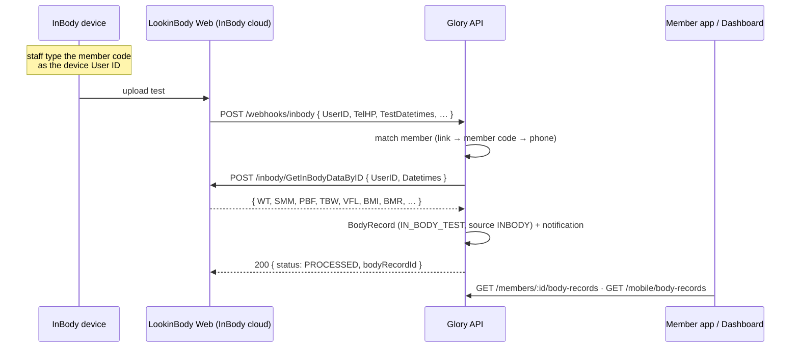

# 18 — InBody integration (LookinBody Web)

> **What it is:** measurements taken on the gym's **InBody** device are added
> to the member's profile **automatically** — no staff typing. The device
> uploads every test to InBody's cloud (**LookinBody Web**, the gym's portal
> at `https://jor.lookinbody.com`), LookinBody calls our webhook, and the
> backend fetches the full result and saves it as an In-Body Test record on
> the member. The member gets an in-app notification.

Full endpoint reference: `docs/API.md` → "InBody integration (LookinBody
Web)". Postman: `postman/GloryGym-InBody.postman_collection.json` (or the
"InBody Integration" folder of the master).

## 1. How the data flows



The other direction happens too: when a member is created on the dashboard
(`POST /members`) the backend pushes them to LookinBody under their **member
code**, so the device already knows them.

## 2. One-time setup checklist (gym admin + backend)

| # | Where | What |
| --- | --- | --- |
| 1 | LookinBody Web → WebAPI site (`apieur.lookinbody.com`) → SETUP | Generate the **API access key** (needs the LB Web admin login). |
| 2 | same page | **Register Customer IP Address** — whitelist the Glory API server's public IP. LookinBody rejects calls from any other address (you'll see it as a `502` "rejected the API key / account (401)" on Test Connection). |
| 3 | same page → Webhook Setup | URL `https://<glory-api>/webhooks/inbody`; add header `X-InBody-Secret: <secret>` (or use `…/webhooks/inbody?token=<secret>`); run InBody's "Operation test". |
| 4 | Glory `.env` | `INBODY_API_KEY`, `INBODY_ACCOUNT` (the LB Web account ID), `INBODY_WEBHOOK_SECRET` (same secret as step 3). Region host stays `INBODY_API_BASE_URL=https://apieur.lookinbody.com`. |
| 5 | Dashboard | `POST /inbody/test-connection` → `ok: true`. Then take one real test and check `GET /inbody/events`. |
| 6 | Dashboard (optional) | For members who already have InBody history: `POST /inbody/members/:id/pull` to backfill. |

Until step 4 is done, every `/inbody/*` call and the webhook return `503`
with a message saying which variable is missing — `GET /inbody/status`
shows `configured: false`. Nothing else in the dashboard is affected.

## 3. Suggested screens

There are no Figma screens for this yet — these are the natural homes, each
backed by one endpoint:

### a. Settings → Integrations → "InBody" card — `GET /inbody/status`

```json
{
  "configured": true,
  "baseUrl": "https://apieur.lookinbody.com",
  "account": "glorygym",
  "timezone": "Asia/Amman",
  "autoRegister": true,
  "pollIntervalMinutes": 0,
  "webhook": { "configured": true, "path": "/webhooks/inbody", "header": "X-InBody-Secret", "queryParam": "token" },
  "events": { "received": 0, "processed": 41, "duplicate": 3, "unmatched": 2, "failed": 1, "total": 47, "lastReceivedAt": "2026-09-03T06:31:02.000Z", "lastStatus": "PROCESSED" },
  "importedRecords": 41,
  "linkedMembers": 38
}
```

Show: a Connected/Not configured pill, the webhook URL + header to copy
into LookinBody (`baseUrl of this API + webhook.path`), the counters, and a
**"Test connection"** button → `POST /inbody/test-connection`
(`{ ok, latencyMs }` or a `502` whose message explains key/IP problems —
surface it verbatim). A **"Pull today"** button → `POST /inbody/pull`
(`{ date, found, imported, duplicate, unmatched, failed, skipped }`).

### b. "InBody events" table — `GET /inbody/events`

Paginated; filters `status`, `memberId`, `search`. Columns: time
(`createdAt`), device (`equip`, `equipSerial`), InBody ID (`userId`) /
phone (`telHp`), test time (`testDateTimes`, `YYYYMMDDHHmmss`), member
(`member.fullName` + `member.memberCode`, or "—"), status pill, `note`.
Row click → `GET /inbody/events/:id` (adds the raw `payload`).

| `status` | Meaning | Action to offer |
| --- | --- | --- |
| `PROCESSED` | Record created — `bodyRecordId` links to the profile record. | Open member. |
| `DUPLICATE` | That test was already imported (InBody re-sent it). Nothing changed. | — |
| `UNMATCHED` | No member matched; `note` says why (unknown ID, unknown phone, or a phone shared by two members). | "Link member" (§3c on the right member) then **Retry**. |
| `FAILED` | LookinBody/API error — `error` has it. | **Retry** → `POST /inbody/events/:id/retry`. |
| `RECEIVED` | Stored but not processed (server died mid-way). Rare. | Retry. |

Retry is only accepted for `FAILED`/`UNMATCHED` (`409` otherwise).

### c. Member profile → "InBody" section — `GET /inbody/members/:memberId`

```json
{
  "memberId": "…", "memberCode": "10042", "fullName": "Ahmed Hossam",
  "inbodyUserId": "10042", "effectiveUserId": "10042",
  "inbodySyncedAt": "2026-09-01T10:00:00.000Z",
  "importedRecords": 3,
  "lastImported": { "id": "…", "recordedAt": "2026-09-03T06:30:00.000Z", "inbodyDateTimes": "20260903093000" },
  "lastEvent": { "status": "PROCESSED", "note": "matched InBody link 10042; record created (weight, muscleMass, …)", "…": "…" },
  "configured": true
}
```

Show the InBody ID the member should use on the device
(`effectiveUserId` — their member code unless linked otherwise), "synced
to LookinBody on …", and three actions:

- **Register / Re-sync** → `POST /inbody/members/:id/register` (after a
  name/phone/DOB edit; creation already does it automatically).
- **Link to existing InBody ID** → `PATCH /inbody/members/:id/link
  { inbodyUserId }` (`null` to unlink) — only for members who were in
  LookinBody before Glory under a different ID. `409` if that ID belongs
  to another member.
- **Import history** → `POST /inbody/members/:id/pull {}` → `{ found,
  imported, skipped, failed[] }`.

`?live=true` on the GET also returns LookinBody's own profile for the
member (`remote`) — handy as a "verify link" button.

### d. The records themselves — nothing new to build

Imported tests appear in the existing In-Body Test panel
(`GET /members/:id/body-records?type=IN_BODY_TEST`) and in the app
(`GET /mobile/body-records`). Each record now carries `source`:

- `MANUAL` — entered by staff (existing flow; `createdBy` set).
- `INBODY` — imported (`createdBy` is `null`; `inbodyEquip` e.g.
  `"InBody770"`, `inbodyDateTimes` the device timestamp). Show an "InBody"
  badge instead of a "Created By" name. Imported records are still
  editable/deletable through the existing endpoints.

## 4. Field mapping — verify once with a real account

| LookinBody key | Record field | Notes |
| --- | --- | --- |
| `WT` | `weight` | kg |
| `SMM` | `muscleMass` | skeletal muscle mass, kg |
| `PBF` | `bodyFat` | **percent** body fat |
| `TBW` | `bodyWater` | total body water, L |
| `VFL` | `visceralFat` | visceral fat level |
| `BMI` | `bmi` | |
| `BMR` | `bmr` | kcal |
| `MetabolicAge`/`BodyAge` | `metabolicAge` | InBody doesn't natively report one — expect `null` |
| `HT`, `BFM`, `InBodyScore`, … | kept in `inbodyRaw` | not on the card yet |

> ⚠ LookinBody's response documentation is behind a login on the WebAPI
> site, so these are InBody's standard abbreviations, matched
> case-insensitively with long-form fallbacks — not a spec anyone could
> read before the account existed. **After the key is configured**, run
> `POST /inbody/members/:id/pull { "dryRun": true }` on a member with a
> real test and compare `preview[].raw` with `preview[].mapped`. If a
> metric is `null` while `raw` has it under another name, tell the backend
> the key — it's a one-line alias fix and nothing needs re-importing (the
> raw object is already stored on every record).

## 5. Gotchas checklist

- **Member code = InBody ID.** That's the whole matching convention: staff
  type the Glory member code on the device. Print it on the membership
  card. The phone fallback (`TelHP`, trailing 9 digits) exists for
  self-mode devices and typos, but a phone shared by two members can't be
  auto-resolved — the event goes `UNMATCHED` and says so.
- **Times are device-local.** `TestDatetimes` has no timezone;
  `INBODY_TIMEZONE` (default `Asia/Amman`) converts it. Render
  `recordedAt` in the gym's timezone like every other timestamp.
- **The webhook always answers `200`** once stored, even when processing
  fails — InBody must never think delivery failed and re-send forever.
  The outcome lives on the event; the events table is where failures
  surface, not the HTTP status.
- **Idempotent.** The same test (member + `TestDatetimes`) can never be
  imported twice; a re-sent webhook or a repeated pull is a `DUPLICATE`/
  `skipped`, not a second record.
- **Auto-register is fire-and-forget.** `POST /members` still returns
  `201` if LookinBody is down; the member just isn't linked yet — the next
  webhook that matches by code or phone links them, or use Register.
- **Deleted members** (soft-deleted) are never matched.
- **`503` vs `502`.** `503` = our side isn't configured (which variable is
  in the message). `502` = LookinBody answered with an error (their message
  is passed through — a `401` there means key/account/IP allowlist).
- **No polling needed by the frontend.** Processing is synchronous; by the
  time the events list refreshes the status is final. The optional server
  poller (`INBODY_POLL_INTERVAL_MINUTES`) is only for hosts LookinBody's
  webhook can't reach.
