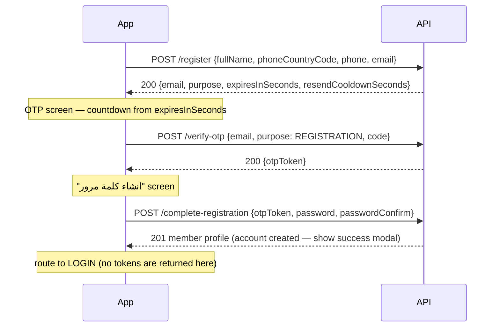

# 01 — Mobile Auth (Member signup, login, forgot password)

> Audience: **mobile app**. Base path: `/mobile/auth`. All these endpoints are
> public except `logout` and `me` (member Bearer token). Employee (dashboard)
> tokens are **rejected** everywhere under `/mobile/*`.

Covers the screens: **اهلا بك في جلوري جيم** (signup), **رمز التحقق** (OTP),
**انشاء كلمة مرور** (create password), **اهلا بعودتك** (login),
**نسيت كلمة المرور** (forgot password), **انشاء كلمة مرور جديدة** (new
password). OTP delivery is **email-only** (the design's send-to-phone and
Apple/Google buttons are not implemented).

| # | Method & path | Purpose |
| --- | --- | --- |
| 1 | `POST /mobile/auth/register` | Signup step 1 — "طلب OTP" |
| 2 | `POST /mobile/auth/verify-otp` | Check the 6-digit code (signup & forgot) |
| 3 | `POST /mobile/auth/resend-otp` | "إعادة إرسال" |
| 4 | `POST /mobile/auth/complete-registration` | Create password → account created |
| 5 | `POST /mobile/auth/login` | Email **or phone** + password |
| 6 | `POST /mobile/auth/forgot-password` | "نسيت كلمة المرور" — request OTP |
| 7 | `POST /mobile/auth/reset-password` | Set the new password |
| 8 | `POST /mobile/auth/refresh` | Rotate the refresh token |
| 9 | `POST /mobile/auth/logout` | Bearer — revoke a refresh token |
| 10 | `GET /mobile/auth/me` | Bearer — current member profile |

## How the OTP works (both flows)

- 6 digits, emailed, valid for **`expiresInSeconds`** from the response
  (default 60 — **drive the countdown from the response, don't hardcode**).
- Max **5** wrong attempts, then the code is dead → request a new one.
- Resend cooldown = **`resendCooldownSeconds`** (default 60). Calling too
  early → `429` ("Please wait Ns…"). A resend **invalidates** the old code.
- A successful `verify-otp` returns a short-lived **`otpToken`** (15 min,
  single-use) that authorizes the matching set-password call only.
- Dev note: without SMTP configured the backend logs the code to its console
  (`[DEV] OTP for <email>: <code>`) instead of emailing.

## Signup flow



### 1. `POST /mobile/auth/register`

| Field | Type | Required | Notes |
| --- | --- | --- | --- |
| `fullName` | string ≤120 | yes | The "اسم المستخدم" field |
| `phoneCountryCode` | string | yes | Dial code, e.g. `"+966"` |
| `phone` | string | yes | 6–15 digits, no country code |
| `email` | string (email) | yes | Normalized to lowercase |

**200:** `{ "email": "...", "purpose": "REGISTRATION", "expiresInSeconds": 60, "resendCooldownSeconds": 60 }`

No Member row exists yet — the account is only created at step 3, so an
abandoned signup leaves nothing behind.

**Errors:** `409` email or phone already registered (offer "تسجيل دخول");
`429` cooldown; `503` mail service down.

> "تغير البريد الالكتروني" on the OTP screen = go **back** and call
> `register` again with the corrected email.

### 2. `POST /mobile/auth/verify-otp`

Body: `{ "email", "purpose": "REGISTRATION" | "PASSWORD_RESET", "code": "123456" }`

**200:** `{ "otpToken": "<jwt>", "purpose": "..." }` — keep it in memory only.

**400 messages** (show under the boxes): `Incorrect code`,
`The code has expired — request a new one`,
`Too many incorrect attempts — request a new code`,
`No pending verification for this email — request a code first`.

### 3. `POST /mobile/auth/resend-otp`

Body: `{ "email", "purpose" }` → same 200 shape as register (restart the
countdown from it). `429` inside the cooldown.

### 4. `POST /mobile/auth/complete-registration`

Body: `{ "otpToken", "password", "passwordConfirm" }`

Password rules = the design checklist, enforced server-side too:
**≥8 chars** (`password must be at least 8 characters`), **≥1 digit**, **≥1
letter**, and both fields matching (`Passwords do not match`). Validate
client-side for the live checklist, but map the server messages as fallback.

**201:** the created member —

```json
{ "id": "...", "memberCode": "10000", "fullName": "أحمد حسام محمد",
  "email": "ahmed@example.com", "phone": "1023359621", "phoneCountryCode": "+966",
  "avatarUrl": null, "status": "ACTIVE", "source": "APP",
  "emailVerifiedAt": "2026-07-17T22:12:26.285Z", "createdAt": "..." }
```

Show the success modal ("لقد تم إنشاء حسابك بنجاح") → route to **login**.
The `otpToken` is now consumed — reusing it → `401`.

## Login — `POST /mobile/auth/login`

Body: `{ "identifier": "...", "password": "..." }` — `identifier` is an
**email or phone** (anything containing `@` is treated as email; phone must
match exactly as registered, digits only).

**200:**

```json
{ "accessToken": "...", "refreshToken": "...", "member": { /* same profile shape as above */ } }
```

`member` also carries **`onboardingCompleted: boolean`** — route to the
first-login questionnaire when `false`, straight to home when `true`
(see [07-onboarding.md](07-onboarding.md)). `GET /mobile/auth/me` returns
the same flag.

**Errors:** `401` generic `Invalid credentials` (never reveals whether the
account exists); `403` `Account is freezed/inactive and cannot log in`.

## Forgot-password flow

Same OTP screens, `purpose: "PASSWORD_RESET"`.

1. `POST /mobile/auth/forgot-password` `{ "identifier": "email or phone" }`
   - **200:** the standard OTP response — `data.email` tells you **where the
     code was sent** (show it on the OTP screen; matters when the user typed
     a phone).
   - **404** (unique to this screen, by design): `This account is not
     registered — check the spelling or create a new account` → the red
     error state under the field.
   - `400` if the account has no email on file.
2. `POST /mobile/auth/verify-otp` with `purpose: "PASSWORD_RESET"` → `otpToken`.
3. `POST /mobile/auth/reset-password` `{ "otpToken", "password",
   "passwordConfirm" }` → **200** `{ "message": "Password reset successfully" }`.
   All member sessions are revoked → success modal → login screen.

## Sessions

- `POST /mobile/auth/refresh` `{ "refreshToken" }` → new
  `{ accessToken, refreshToken, member }`. **Rotation**: persist both new
  tokens; the old refresh is dead (`401` if reused).
- `POST /mobile/auth/logout` (Bearer) `{ "refreshToken" }` → revokes it.
- `GET /mobile/auth/me` (Bearer) → fresh member profile. `401` also when the
  account was deactivated/deleted — treat any `me` 401 as "session ended".

## Mobile-side checklist

1. Store tokens in secure storage (Keychain/Keystore), never plain prefs.
2. On app start: `GET /mobile/auth/me`; on 401 → try refresh once → login.
3. Countdown + resend button state come from `expiresInSeconds` /
   `resendCooldownSeconds` — never hardcode 60.
4. `otpToken` is single-use and expires in 15 min — if the user lingers on
   the password screen too long, a `401` means restart the OTP step.
5. Trim + lowercase emails client-side too (the API does it anyway).
6. Phone login must match the registered digits exactly (no `+`/spaces).
