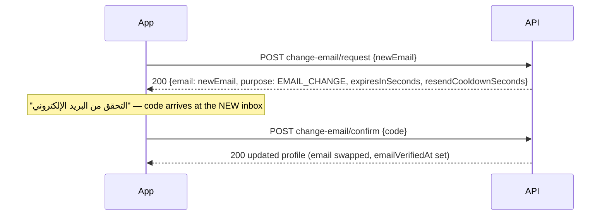

# 02 — Mobile Profile & Settings

> Audience: **mobile app**. Everything here requires the **member Bearer
> token** from login. Covers the screens: **الإعدادات**, **ملفي الشخصي**,
> **تعديل البريد الالكتروني** + its OTP screen, **تغير كلمة السر**,
> **الاشعارات** toggle, **لغة التطبيق**, **حذف الحساب** + **اثبات هويتك**,
> **اشتراكاتي**, **فحص تكوين الجسم**, **قياسات الحجم**, and the avatar upload.

| # | Method & path | Screen element |
| --- | --- | --- |
| 1 | `GET /mobile/profile` | Settings header card + profile screen |
| 2 | `PATCH /mobile/profile` | "حفظ" / "تعديل الحساب" |
| 3 | `PATCH /mobile/profile/notifications` | "الاشعارات" toggle |
| 4 | `POST /mobile/profile/change-password` | "تغير كلمة السر" |
| 5 | `POST /mobile/profile/change-email/request` | "تعديل البريد الالكتروني" — طلب OTP |
| 6 | `POST /mobile/profile/change-email/confirm` | "التحقق من البريد الإلكتروني" |
| 7 | `POST /mobile/profile/delete-account/request` | "حذف الحساب" → "اثبات هويتك" |
| 8 | `DELETE /mobile/profile/delete-account/confirm` | Confirm deletion |
| 9 | `GET /mobile/subscriptions` | "اشتراكاتي" |
| 10 | `GET /mobile/body-records` | "فحص تكوين الجسم" / "قياسات الحجم" |
| 11 | `POST /mobile/uploads` | Avatar camera button |

---

## 1. `GET /mobile/profile`

The single source for the settings header card **and** the profile form:

```json
{ "success": true, "data": {
  "id": "cm...", "memberCode": "10000",
  "fullName": "احمد حسام محمد",
  "email": "info@futureegypt.com",
  "phone": "1023359621", "phoneCountryCode": "+20",
  "avatarUrl": "https://res.cloudinary.com/...",
  "gender": "MALE",
  "dateOfBirth": "2003-09-19T00:00:00.000Z",
  "maritalStatus": "SINGLE",
  "healthNotes": "لا يوجد امراض",
  "pushEnabled": true,
  "appLanguage": "ar",
  "status": "ACTIVE", "source": "APP",
  "emailVerifiedAt": "...", "createdAt": "..."
} }
```

`pushEnabled` drives the notifications toggle, `appLanguage` the language row.

## 2. `PATCH /mobile/profile` — edit profile

All fields optional; send **only what changed**:

| Field | Type | Notes |
| --- | --- | --- |
| `fullName` | string ≤120 | "اسم المستخدم" |
| `dateOfBirth` | date string `"2003-09-19"` | "تاريخ الميلاد" |
| `gender` | `MALE` \| `FEMALE` | |
| `maritalStatus` | `SINGLE` \| `MARRIED` | "الحالة الاجتماعية" (أعزب = SINGLE) |
| `healthNotes` | string ≤1000 | "الحالة الصحية" free text |
| `avatarUrl` | URL | from `POST /mobile/uploads` |
| `appLanguage` | `"ar"` \| `"en"` | "لغة التطبيق" |

**200:** the updated full profile (same shape as GET).

> ⚠ **`phone` and `email` are rejected here** (`400 "property … should not
> exist"`). Phone is read-only (the greyed field); email changes only via the
> OTP flow below — exactly like the design.

## 3. `PATCH /mobile/profile/notifications`

Body `{ "enabled": true | false }` → **200** `{ "pushEnabled": ... }`.
Toggle optimistically, revert on error.

## 4. `POST /mobile/profile/change-password`

Body: `{ "currentPassword", "password", "passwordConfirm" }` — new password
follows the signup rules (≥8, ≥1 digit, ≥1 letter, match).

**200:** `{ "message": "Password changed successfully" }` — **all sessions
are revoked**: take the user to login (or silently re-login with the new
password).

**400:** `Current password is incorrect` / rule violations / mismatch.

## 5–6. Change email (OTP to the NEW address)



- **request** errors: `400` same as current email; `409` email already used
  by another account; `429` cooldown.
- **confirm** errors: `400` wrong/expired code or too many attempts.
- Resend button: `POST /mobile/auth/resend-otp`
  `{ "email": "<newEmail>", "purpose": "EMAIL_CHANGE" }`.
- After success the user logs in with the **new** email next time (current
  session stays valid).

## 7–8. Delete account ("اثبات هويتك")

Step 1 — `POST /mobile/profile/delete-account/request` (no body): sends the
code to the **current** email → standard OTP response. The "اثبات هويتك"
screen is this code's entry.

Step 2 — `DELETE /mobile/profile/delete-account/confirm` with
`{ "code": "123456" }`:

- **200** `{ "message": "Account deleted" }` — wipe local storage, go to
  signup. Personal data (family, body records, sessions, feedback) is deleted.
- **409** — the account has gym business records (subscriptions/bookings):
  `...cannot be deleted from the app — please contact the gym`. Show that
  message; nothing was deleted.
- **400** wrong/expired code.

> ⚠ Codes are **single-use**: after a 409 (or any consumed attempt) you must
> call `request` again for a fresh code before retrying.

## 9. `GET /mobile/subscriptions` — "اشتراكاتي"

Paginated (`page`/`limit`), newest first. Card mapping:

```json
{ "id": "...",
  "startDate": "2026-06-10T00:00:00.000Z",   // تاريخ البداية
  "endDate": "2026-05-01T00:00:00.000Z",     // تاريخ الانتهاء
  "status": "ACTIVE",                         // ACTIVE|FROZEN|VOIDED|EXPIRED|TRANSFERRED|CANCELED
  "sessionCount": 12, "remainingSessions": 8,
  "package": { "id": "...", "nameEn": "Sessions Package", "nameAr": "باقة الحصص",
               "membershipType": "PT",        // نوع الباقة: GYM|APP|PT|CLASS|ASSESSMENT
               "durationUnit": "SESSION", "durationValue": 12 } }
```

"اسم الباقة" = `nameAr`/`nameEn` by app language; "نوع الباقة" = localize
`membershipType` (e.g. PT/CLASS → "حصص"). Empty list = member has no
subscriptions yet (sold at the gym).

## 10. `GET /mobile/body-records?type=…`

- `type=IN_BODY_TEST` → **فحص تكوين الجسم** screen.
- `type=BODY_MEASUREMENT` → **قياسات الحجم** screen.
- Omit `type` → both. Paginated, newest first. Bad type → `400`.

```json
{ "id": "...", "type": "IN_BODY_TEST",
  "weight": "82.5",        // الوزن
  "bodyFat": "21.4",       // نسبة الدهون في الجسم
  "bmi": "25.1",           // موشر كتلة الجسم
  "metabolicAge": 24,      // العمر الايضي
  "muscleMass": "36.2",    // التكتلة العضلية
  "visceralFat": "7",      // مستوى الدهون الحشوية
  "bmr": "1750",           // معدل الايض الاساسي
  "bodyWater": null, "pdfUrl": null,
  "recordedAt": "2026-04-05T00:00:00.000Z",           // card date
  "createdBy": { "id": "...", "fullName": "احمد حسام" } // اصدار بواسطة
}
```

Numeric values are **decimal strings** (or null when not measured) — render
`"—"`/`"000"` style placeholders for nulls. Records are created by gym staff;
the app is read-only.

## 11. `POST /mobile/uploads` — avatar

Multipart, field **`file`**, PNG/JPG/PDF ≤ 5 MB → `{ "url", "fileSize", ... }`.
Then `PATCH /mobile/profile { "avatarUrl": url }`. Errors: `400` type/size,
`503` Cloudinary unconfigured.

---

## Screen wiring summary (الإعدادات rows)

| Row | Action |
| --- | --- |
| Header card + تعديل الملف الشخصي | `GET /mobile/profile` → profile screen |
| الملف الشخصي | screens above (1, 2, 11) |
| فحص تكوين الجسم | `GET /mobile/body-records?type=IN_BODY_TEST` |
| قياسات الحجم | `GET /mobile/body-records?type=BODY_MEASUREMENT` |
| اشتراكاتي | `GET /mobile/subscriptions` |
| تغير كلمة السر | endpoint 4 |
| أفراد العائلة | [03-family.md](03-family.md) |
| معلومات عن جلوري جيم | [04-content.md](04-content.md) |
| الاشعارات toggle | endpoint 3 |
| لغة التطبيق | `PATCH /mobile/profile { appLanguage }` |
| تسجيل خروج | `POST /mobile/auth/logout` |
| حذف الحساب | endpoints 7–8 |
