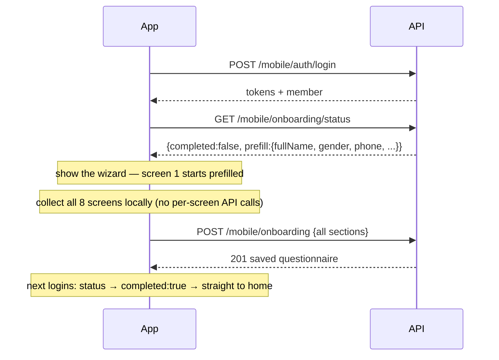

# 07 — First-Login Onboarding ("البيانات الشخصية" → "الهدف من الاشتراك")

> Audience: **mobile app**. Member Bearer token required. Covers the 8-step
> intake wizard shown **once, right after the member's first login**: the
> PAR-Q health questionnaire + fitness intake.

| # | Method & path | Purpose |
| --- | --- | --- |
| 1 | `GET /mobile/onboarding/status` | Show the wizard or go home? (call after every login) |
| 2 | `POST /mobile/onboarding` | Submit all 8 sections in one call (final step) |
| 3 | `GET /mobile/onboarding` | Read the saved answers back (404 if never submitted) |

## Flow

- The wizard state lives **client-side** — nothing is sent until the final
  step submits everything in one `POST`.
- Submission is **one-time**: a second `POST` → `409` ("already completed").
  There is no edit screen in the design; treat the wizard as write-once.
- `prefill` (from the status call) carries the member's registered
  `fullName` / `gender` / `phone` / `phoneCountryCode` so screen 1 starts
  filled — the member can still change them for this form (editing here does
  **not** change the account profile; the one exception is `gender`, which is
  copied **to** the profile only if the profile didn't have one yet).

## 2. `POST /mobile/onboarding` — field reference by screen

All عربية labels below are the design's exact wording. Send decimals as
**strings** (`"2.5"`), booleans as real booleans, and enums as the listed
values.

### 1️⃣ البيانات الشخصية

| Field | Type | Required | Label |
| --- | --- | --- | --- |
| `fullName` | string ≤120 | ✅ | الاسم الكامل |
| `age` | int 10–100 | ✅ | العمر (سنة) |
| `gender` | `MALE`\|`FEMALE` | ✅ | الجنس (ذكر/أنثى) |
| `phoneCountryCode` | string ≤6 | — | كود الدولة (+966) |
| `phone` | string, 6–15 digits | ✅ | رقم الهاتف |
| `occupation` | string ≤120 | ✅ | المهنة |

### 2️⃣ التاريخ الصحي (PAR-Q)

| Field | Type | Required | Label |
| --- | --- | --- | --- |
| `hasChronicDisease` | boolean | ✅ | هل لديك أي مرض مزمن؟ (سكري، ضغط، قلب...) |
| `takesMedications` | boolean | ✅ | هل تتناول أي أدوية بشكل دائم؟ |
| `hasInjuries` | boolean | ✅ | هل لديك أي إصابات حالية أو سابقة؟ |
| `injuriesDetails` | string ≤1000 | **when نعم** | اذكر موضع الإصابة وتاريخها |
| `hadSurgery` | boolean | ✅ | هل أجريت أي عملية جراحية؟ |
| `surgeryDetails` | string ≤1000 | **when نعم** | تفاصيل العملية |

### 3️⃣ النشاط البدني الحالي

| Field | Type | Required | Label |
| --- | --- | --- | --- |
| `currentlyExercising` | boolean | ✅ | هل تمارس الرياضة حالياً؟ |
| `exerciseDaysPerWeek` | int 1–7 | **when نعم** | عدد أيام التمرين في الأسبوع |
| `exerciseTypes` | string ≤200 | — | نوع التمارين (أوزان، كارديو، سباحة) |
| `exercisingSince` | string ≤200 | — | منذ متى تتمرن؟ (سنة وثلاثة أشهر) |

### 4️⃣ التغذية

| Field | Type | Required | Label |
| --- | --- | --- | --- |
| `followsDiet` | boolean | ✅ | هل تتبع نظاماً غذائياً؟ |
| `mealsPerDay` | int 1–12 | ✅ | عدد الوجبات اليومية |
| `waterLitersPerDay` | decimal string | ✅ | كمية الماء اليومية (لتر) |
| `usesSupplements` | boolean | ✅ | هل تستخدم مكملات غذائية؟ |

### 5️⃣ نمط الحياة

| Field | Type | Required | Label |
| --- | --- | --- | --- |
| `sleepHours` | decimal string | ✅ | عدد ساعات النوم |
| `workNature` | `DESK`\|`MODERATE`\|`PHYSICAL` | ✅ | طبيعة العمل: مكتبي / حركة متوسطة / مجهود بدني |
| `stressLevel` | `LOW`\|`MEDIUM`\|`HIGH` | ✅ | مستوى التوتر: منخفض / متوسط / مرتفع |

### 6️⃣ القياسات (سم)

| Field | Type | Required | Label |
| --- | --- | --- | --- |
| `bodyFatPct` | decimal string | — | نسبة الدهون (إن وجدت) |
| `waistCm` | decimal string | ✅ | محيط الخصر |
| `chestCm` | decimal string | ✅ | محيط الصدر |
| `armCm` | decimal string | ✅ | محيط الذراع |
| `thighCm` | decimal string | ✅ | محيط الفخذ |
| `photoUrls` | string[] ≤10 | — | الصور (اختيارية) — upload each via `POST /mobile/uploads` first |

### 7️⃣ معلومات التدريب

| Field | Type | Required | Label |
| --- | --- | --- | --- |
| `committedDaysPerWeek` | int 1–7 | ✅ | عدد الأيام التي تستطيع الالتزام بها أسبوعياً |
| `preferredTime` | `MORNING`\|`NOON`\|`EVENING`\|`NIGHT` | ✅ | الوقت المفضل: صباحاً / ظهراً / مساءً / ليلاً |
| `preferredExerciseType` | `MACHINES`\|`FREE_WEIGHTS`\|`BOTH` | ✅ | التمارين المفضلة: أجهزة / أوزان حرة / الاثنان |
| `trainedWithCoachBefore` | boolean | ✅ | هل سبق أن تدربت مع مدرب شخصي؟ |
| `previousCoachDetails` | string ≤1000 | **when نعم** | اذكر المدة والبرنامج السابق |

### 8️⃣ الهدف من الاشتراك

| Field | Type | Required | Label |
| --- | --- | --- | --- |
| `goals` | enum[] (multi, unique, ≥1) | ✅ | ما الذي تسعى إلى تحقيقه؟ |
| `otherGoal` | string ≤500 | — | هدف آخر |

`goals` values → chips: `FAT_LOSS` خسارة دهون · `STRENGTH_GAIN` زيادة القوة ·
`FITNESS_IMPROVEMENT` تحسين اللياقة · `REHABILITATION` إعادة تأهيل بعد إصابة ·
`BODY_TONING` شد الجسم · `MUSCLE_GAIN` زيادة كتلة عضلية.

**Responses:** `201` the saved questionnaire · `400` validation (the
`errors[]` array names each offending field) · `409` already completed ·
`401` no/expired member token.

---

## Gotchas checklist

1. Call `/status` after **every** login, not just the first — it's the only
   signal for whether to show the wizard.
2. Validate the conditional rules client-side too (details required when نعم,
   days required when exercising) — the server enforces them and 400s
   otherwise.
3. Decimals are strings in and out (`"2.5"`); don't send JS numbers for the
   water/sleep/measurement fields.
4. Photos: upload each image through `POST /mobile/uploads` (PNG/JPG ≤5MB)
   first, then pass the returned URLs in `photoUrls`.
5. One submission only — disable the submit button after a `201`, and treat
   a `409` as "already done, go home".
6. The dashboard side (staff viewing these questionnaires — the
   "Questionnaire Management" nav item) isn't built yet; this module is the
   member-facing half.
