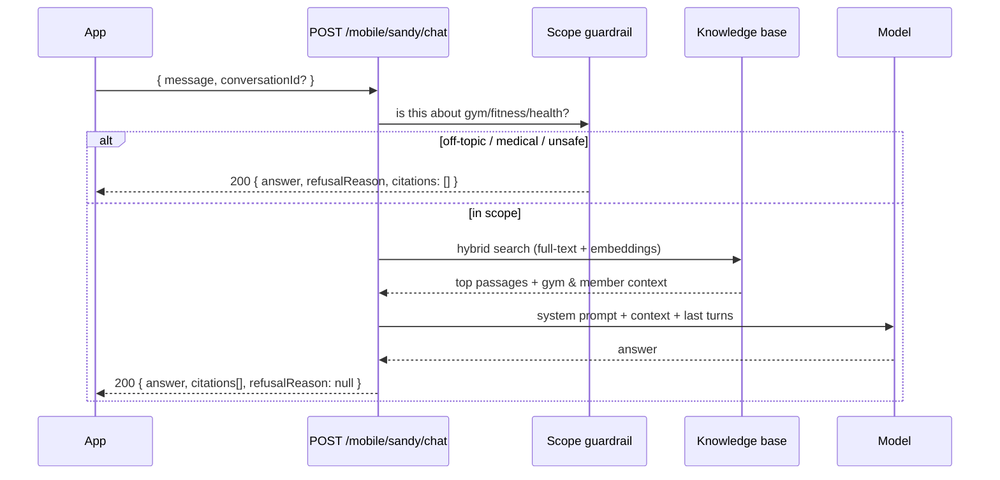

# Sandy AI — the gym assistant (mobile)

Sandy is an in-app chat that answers questions about **the gym, training,
exercise, nutrition and physical health** — and nothing else. All endpoints use
the **member** bearer token (`{{memberAccessToken}}`), same as the rest of
`/mobile/*`.

> Sandy is a *separate feature* from **Coach Chat**
> ([08-chat.md](08-chat.md)). Coach Chat is a real-time Socket.IO conversation
> with a **human** instructor. Sandy is a plain REST request/response with an
> AI. Don't wire them to the same screen or reuse the socket.

---

## 1. The flow



Nothing is streamed — one request, one complete answer. Show a typing indicator
while it's in flight; a normal answer takes roughly 1–4 seconds.

---

## 2. Endpoints

| Screen action | Endpoint |
| --- | --- |
| Send a message | `POST /mobile/sandy/chat` |
| Empty-state prompt chips | `GET /mobile/sandy/suggestions?lang=ar` |
| Chat history list | `GET /mobile/sandy/conversations` |
| Open a thread | `GET /mobile/sandy/conversations/:id/messages` |
| Rename a thread | `PATCH /mobile/sandy/conversations/:id` |
| Delete a thread | `DELETE /mobile/sandy/conversations/:id` |

### `POST /mobile/sandy/chat`

```jsonc
// request
{ "message": "كام جرام بروتين محتاج في اليوم؟", "conversationId": null }

// 200
{
  "conversationId": "clx...",   // save it — omit it only for the FIRST message
  "messageId": "clx...",
  "answer": "الكمية المناسبة حوالي 1.6 إلى 2.2 جرام لكل كيلو من وزن جسمك...",
  "citations": [
    { "docId": "clx...", "title": "How much protein you actually need",
      "sourceName": "Examine.com", "sourceUrl": "https://examine.com/..." }
  ],
  "refusalReason": null,
  "meta": { "model": "gpt-luna", "latencyMs": 812, "retrievedChunks": 4 }
}
```

**Sandy replies in the language the member wrote in** — Arabic question, Arabic
answer; English question, English answer. Don't send a language parameter and
don't translate client-side. This holds even though most source documents are
English.

`citations[]` are the sources behind the answer. Render them as tappable chips
under the bubble opening `sourceUrl` in a browser. The array is **empty on every
refusal** — guard your rendering on `citations?.length`.

Citations are deliberately narrower than what the model was given: only
documents scoring close to the best match are cited, capped at 4. So
`citations.length` is usually 1–3 and will often be smaller than
`meta.retrievedChunks` — that is correct, not a truncation bug.

---

## 3. Refusals are `200`, not errors ⚠

This is the single most important integration detail. When Sandy declines, the
HTTP status is still **`200`** and `answer` still contains friendly, useful text.
Only `refusalReason` is non-null.

| `refusalReason` | When | Suggested UI |
| --- | --- | --- |
| `OUT_OF_SCOPE` | Not about gym/fitness/nutrition/health | Normal bubble. Optionally re-show the suggestion chips. |
| `MEDICAL_ADVICE` | Diagnosis / prescription / treatment | Normal bubble + a "تواصل مع مدربك" button into Coach Chat. |
| `UNSAFE` | PEDs, starvation diets, disordered-eating patterns | Normal bubble, no extra CTA. |
| `PROVIDER_ERROR` | The AI provider is down or unconfigured | Bubble **plus** a retry affordance — this one is transient. |

Do **not** render refusals as red error states. `OUT_OF_SCOPE` in particular is
the expected, designed behaviour of the product, not a failure.

Real HTTP errors are the usual ones: `400` (empty or >2000-char message),
`401` (missing/expired token — refresh and retry), `404` (a `conversationId`
that isn't the caller's).

---

## 4. Conversations

`GET /mobile/sandy/conversations` → newest activity first:

```jsonc
[{ "id": "clx...", "title": "كام جرام بروتين محتاج في اليوم؟",
   "createdAt": "...", "lastMessageAt": "...", "messageCount": 6,
   "lastMessage": { "body": "...", "senderType": "ASSISTANT", "createdAt": "..." } }]
```

`title` is auto-derived from the member's first message (truncated). It is never
null after the first turn, so it's safe to render directly; `PATCH` lets the
member rename it.

`GET .../messages` is paginated **newest page first** (page 1 = most recent) —
the same convention as Coach Chat — but messages *within* a page are ordered
oldest→newest so a page renders top-to-bottom as-is. For infinite scroll:
render page 1, then prepend page 2 above it, and so on.

---

## 5. What Sandy knows about the member

Sandy is given the caller's own live context automatically — name, active
subscription and remaining days, assigned instructor, current workout
assignment, plus gym data (branches, active packages, facilities, FAQs). So
these all work without the app passing anything extra:

- «فاضلي كام يوم في اشتراكي؟»
- «مين الكابتن بتاعي؟»
- «إيه الباقات المتاحة؟»
- «الفرع فين؟»

Sandy is told to answer gym-specific questions **only** from that live data, so
it won't invent prices or opening hours that aren't in the database.

---

## 6. Gotchas

1. **Refusals are `200`.** Repeated because it is the number-one thing to get
   wrong. Check `refusalReason`, not the status code.
2. **Omit `conversationId` only on the very first message**, then reuse the one
   that came back. Sending `null` on every message silently starts a new thread
   each time and the member loses all context.
3. **Only the last few turns are sent to the model** (`SANDY_HISTORY_TURNS`,
   default 4). A reference to something twenty messages back may not resolve.
4. **`citations` is empty on refusals** — guard before mapping over it.
5. **Sandy is not a doctor and is prompted to say so.** For anything clinical
   it will redirect to a professional. Don't try to prompt around it.
6. **Employee tokens get `401` here**, and member tokens get `401` on
   `/sandy-ai/*`. Two separate token families, as everywhere else in this API.
7. **`meta` is for debugging** (model, latency, chunk count) — don't show it in
   the member UI.
